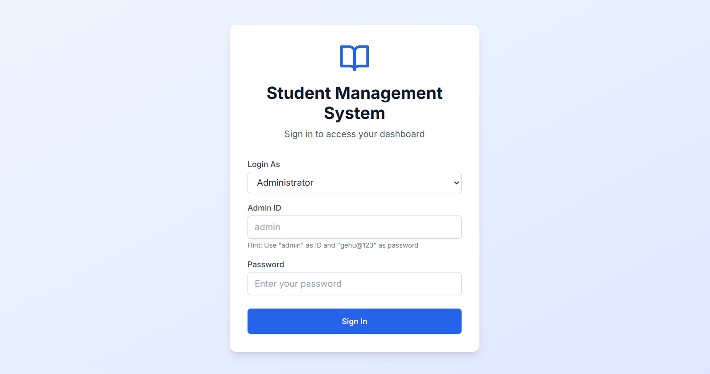
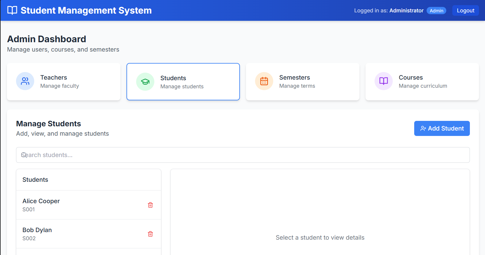
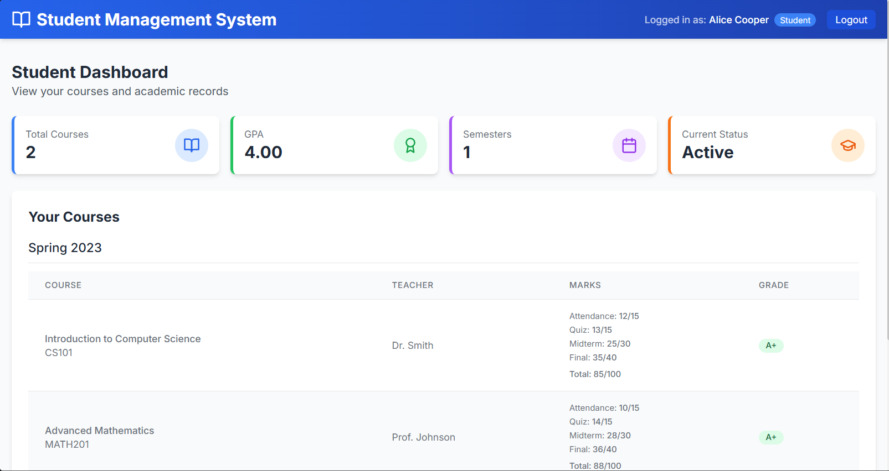
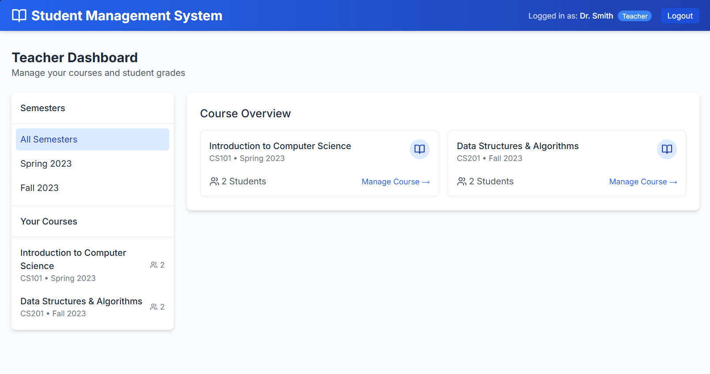

# 🎓 Student Management System


A **Student Management System** developed using **Bash Shell Scripting** with a modern **React + TypeScript GUI**. The system provides secure, role-based access for **Administrators**, **Teachers**, and **Students**, allowing efficient management of academic records, enrollments, attendance, and grades.

The application combines a Bash-based backend with a responsive frontend, while storing data using lightweight CSV files.

---

# 📖 Overview

The Student Management System is designed to simplify academic administration through a role-based interface.

It enables administrators to manage users and courses, teachers to maintain attendance and grades, and students to access their academic records.

This project demonstrates:

- Bash Shell Scripting
- Role-Based Authentication
- CSV File Handling
- React Frontend Development
- TypeScript
- File Management
- GUI Design

---

# ✨ Features

## 👨‍💼 Administrator

- Create Teachers
- Create Students
- Create Courses
- Create Semesters
- Assign Teachers to Courses
- Enroll Students
- Delete Students
- View All Records
- Manage Academic Data

---

## 👩‍🏫 Teacher

- Secure Login
- View Assigned Courses
- View Enrolled Students
- Update Attendance
- Enter Quiz Marks
- Enter Mid-Term Marks
- Enter Final Marks
- Manage Student Performance

---

## 👨‍🎓 Student

- Secure Login
- View Enrolled Courses
- Check Attendance
- View Quiz Marks
- View Mid-Term Marks
- View Final Marks
- View Overall Grades

---

# 🛠️ Technologies Used

- Bash Shell Scripting
- React
- TypeScript
- Vite
- Tailwind CSS
- CSV File Storage
- Role-Based Authentication
- File Handling
- Git & GitHub

---

# 📂 Project Structure

```text
Student-Management-System/
│
├── src/                     # React source code
├── screenshots/             # Application screenshots
│   ├── login.png
│   ├── dashboard.png
│   ├── teacher.png
│   └── student.png
│
├── sms.sh                   # Bash backend script
├── package.json
├── package-lock.json
├── vite.config.ts
├── tsconfig.json
├── tailwind.config.js
├── README.md
└── .gitignore
```

---

# 🚀 Getting Started

## Prerequisites

Before running the project, install:

- Git
- Node.js
- npm
- Bash (Linux / Git Bash / WSL)

---

## Clone the Repository

```bash
git clone https://github.com/Yougeshkumar/Student-Management-System.git
```

---

## Navigate to the Project

```bash
cd Student-Management-System
```

---

## Install Dependencies

```bash
npm install
```

---

## Run React Frontend

```bash
npm run dev
```

---

## Run Bash Backend

```bash
chmod +x sms.sh
./sms.sh
```

---

# 🔐 User Roles

| Role | Responsibilities |
|------|------------------|
| 👨‍💼 Admin | Manage students, teachers, courses and semesters |
| 👩‍🏫 Teacher | Manage attendance and student marks |
| 👨‍🎓 Student | View courses, attendance and grades |

---

# 💾 Data Storage

The application stores information using CSV files.

The following records are maintained:

- Student Details
- Teacher Details
- Course Details
- Semester Information
- Student Enrollments
- Attendance Records
- Quiz Marks
- Mid-Term Marks
- Final Examination Marks
- Overall Grades

---

# 📸 Screenshots

<h3 align="center">🔐 Login Screen</h3>

<p align="center">

</p>

---

<h3 align="center">📊 Dashboard</h3>

<p align="center">

</p>

---

<h3 align="center">👨‍🎓 Student Panel</h3>

<p align="center">

</p>

---

<h3 align="center">👩‍🏫 Teacher Panel</h3>

<p align="center">

</p>

---

# 🎯 Key Highlights

- ✅ Role-Based Authentication
- ✅ Responsive GUI
- ✅ CSV Database
- ✅ Course Management
- ✅ Attendance Tracking
- ✅ Grade Management
- ✅ Student Enrollment
- ✅ Teacher Assignment
- ✅ React + TypeScript Frontend
- ✅ Bash Backend

---

# 📈 Future Improvements

- MySQL/PostgreSQL Integration
- REST API Backend
- Docker Support
- PDF Report Generation
- Email Notifications
- Cloud Deployment
- Admin Analytics Dashboard
- Student Profile Management
- Mobile Responsive UI
- Dark Mode

---

# 🤝 Contributing

Contributions are welcome.

### Fork the repository

```bash
git fork
```

### Create a branch

```bash
git checkout -b feature-name
```

### Commit your changes

```bash
git commit -m "Added new feature"
```

### Push the changes

```bash
git push origin feature-name
```

### Create a Pull Request

---

# 👨‍💻 Author

## Yougesh Kumar

**AI & ML Engineer | Full Stack Developer**

📧 Email  
yougeshkumar8809@gmail.com

💼 LinkedIn  
https://linkedin.com/in/yougeshkumar22

💻 GitHub  
https://github.com/Yougeshkumar

---

# ⭐ Support

If you found this project useful, please consider giving it a ⭐ on GitHub.

It helps others discover the project and motivates further development.

---

# 📄 License

This project was developed for **educational and learning purposes**.

© 2026 Yougesh Kumar. All Rights Reserved.